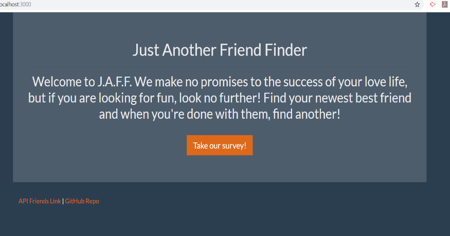
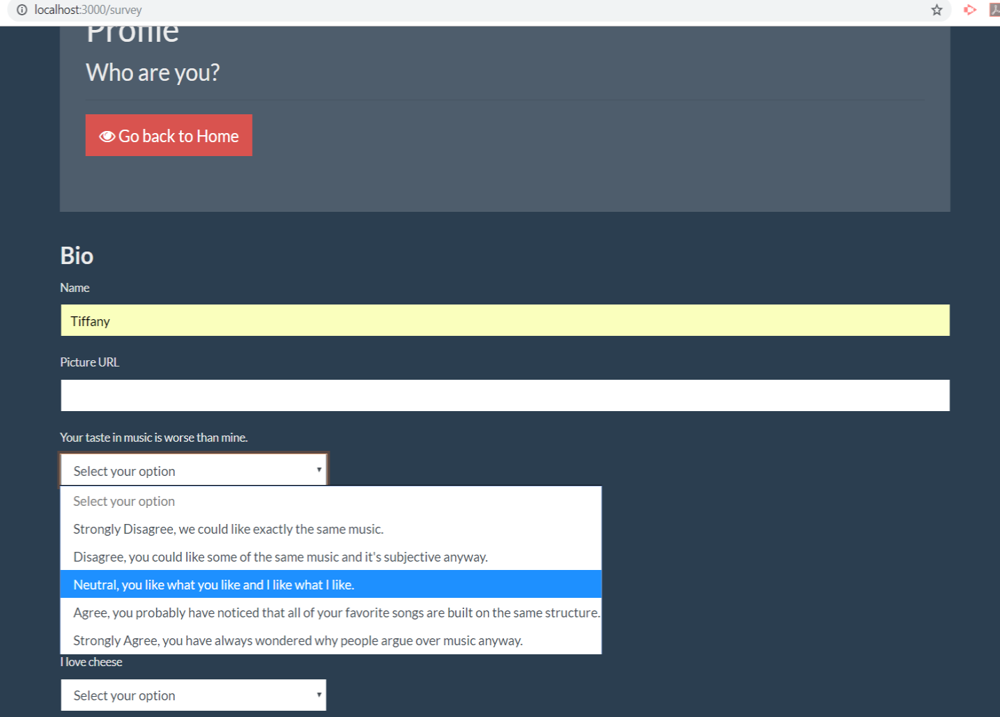
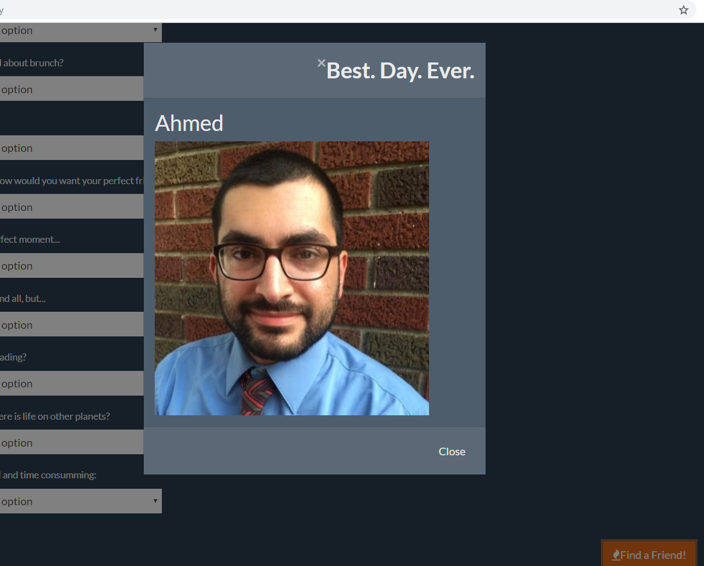

# Friend-Finder

This is a comptability-based "FriendFinder" application, like a dating app. 

This is a full-stack site that intakes the users' surveys then compares answers with other users. 

The app then displays the name and picture of their best overall match.

## What I Learned

In order to build this app, I used Express to handle the routing.

Also, this assignment was an introduction to deploying to Heroku.

## Screenshots of Site

### Home Page

### Survey

### Results

